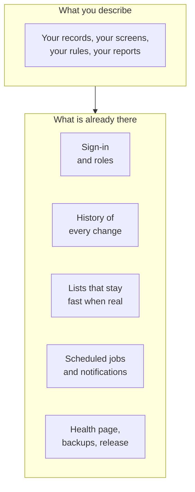

import { Aside, LinkCard } from '@astrojs/starlight/components';

These are the things that usually take the first month of a project. They are
already written, already tested, and already decided, so your first conversation
is about your process rather than about plumbing.

You do not switch any of them on. They are there; a feature you ask for uses
them.

## The list

| Feature                                           | What it means for you                                                                                                                                                                                                            | Where you see it                                     |
| ------------------------------------------------- | -------------------------------------------------------------------------------------------------------------------------------------------------------------------------------------------------------------------------------- | ---------------------------------------------------- |
| **Sign-in with invitations**                      | Nobody signs themselves up. You invite people by e-mail, by name. Sign-in is a password or a link sent to their inbox.                                                                                                           | The sign-in screen, and the people page              |
| **Three roles**                                   | Owner, member, viewer. Who enters, who approves, who only reads — without inventing a permissions system per feature.                                                                                                            | The people page; what each person can open           |
| **History on every record**                       | Every record says who created it and who last changed it, and when. Changes that matter are also kept in a plain list.                                                                                                           | On a record's page                                   |
| **Lists that stay fast**                          | Filtering, sorting and paging happen in the database, so a list with fifty thousand rows behaves like one with fifty.                                                                                                            | Every list screen                                    |
| **Filters that are a link**                       | A filtered list is an address you can send a colleague or bookmark, and it survives a reload.                                                                                                                                    | The address bar, after you filter                    |
| **Forms that check themselves**                   | A wrong value is caught before it is saved, and the message appears under the field it belongs to.                                                                                                                               | Every form                                           |
| **File attachments**                              | Documents and photos attach to records and live on your own server, not in somebody's cloud.                                                                                                                                     | On a record's page                                   |
| **Scheduled work**                                | Things that happen on a clock: a nightly digest, a reminder at 07:00, a monthly roll-up. One failing job never stops the rest.                                                                                                   | The system screen, and whatever the job produces     |
| **Notifications**                                 | One way to send a person a message, with e-mail working on day one. Other channels are a recipe, not a rebuild.                                                                                                                  | Their inbox                                          |
| **A system screen that shows only what is wrong** | No wall of green ticks. When there is nothing wrong it says so in one line; when there is, that is what you read.                                                                                                                | `/system`, owner only                                |
| **Installable on a phone**                        | It goes on the home screen with its own icon, opens without a browser bar, and pulls down to refresh. When a new version is out it offers to reload rather than swapping under your fingers.                                     | Your phone                                           |
| **One time zone, one format**                     | The whole app shows dates, times and numbers the same way for everyone, in the zone you chose — not in the reader's.                                                                                                             | Everywhere a date appears                            |
| **Download as a spreadsheet**                     | Any list can leave the app as a CSV. Your data is never trapped.                                                                                                                                                                 | The download action on a list                        |
| **AI helpers, on a budget**                       | Sorting, suggesting, drafting, answering questions about your data — with a monthly ceiling the app enforces itself. What the model proposes, a person or a rule confirms; it never produces a number you are shown as a figure. | Wherever you asked for one                           |
| **Security on by default**                        | HTTPS only, a limit on repeated sign-in attempts, sessions that expire, secrets kept out of the project.                                                                                                                         | Mostly invisible, which is the point                 |
| **A copy every night**                            | The database is copied at 03:15 and kept fourteen days, plus one taken immediately before every release.                                                                                                                         | [Backups](../reference/backups.md)                   |
| **One-command release**                           | Build, test, rehearse the database change on real data, back up, switch, verify. A failure before the switch changes nothing.                                                                                                    | [Publishing to your server](./publishing.mdx)        |
| **A safe copy for debugging**                     | When something is wrong, the agent works on a copy of the real data on its own machine, never on the live one.                                                                                                                   | [When something breaks](./when-something-breaks.mdx) |
| **A quiet, dense design**                         | Numbers loudest, one accent colour, dark mode that follows your phone. A script checks that every new screen obeys it.                                                                                                           | Every screen                                         |
| **Everything written down**                       | Decisions, releases and incidents recorded in plain words, so a conversation months from now already knows the project.                                                                                                          | The project's own files, and the agent's reports     |

<Aside type="tip" title="One worked example ships with it">
  The kit arrives with one complete record type — list, detail, form, history, a scheduled job and a
  notification — as the pattern the agent copies for yours. Once you have something of your own, ask
  it to delete the example.
</Aside>

## Deliberately not built in

These are **recipes** rather than features: the pieces they need are present, and
the agent has written instructions for assembling each one when you actually want
it. Asking for any of them is a sentence.

| Recipe                        | One line                                                                                       |
| ----------------------------- | ---------------------------------------------------------------------------------------------- |
| **Dashboards and reports**    | The chart components ship; which numbers matter is yours to name, so it is built to order.     |
| **Importing a spreadsheet**   | The one-time migration out of the sheet you are replacing, done as a described exercise.       |
| **Telegram, Slack, web push** | Extra places a notification can arrive, alongside e-mail.                                      |
| **Off-site backups**          | A nightly encrypted copy to object storage — the one to add the day the app is critical.       |
| **A second small server**     | Somewhere to keep backups, run the checks, and bring up a copy of production to debug against. |
| **Approvals and comments**    | A review step, or a conversation attached to a record, when your process needs one.            |
| **Error tracking**            | A hosted service watching for failures, when the system screen and the logs stop being enough. |
| **A second language**         | Every readable string already goes through one place, so a second language is a file.          |

<Aside type="caution" title="Two things it is deliberately not">
  There is no second organisation and no public sign-up. Every app from this kit is **one** company,
  team or household, with people you invite by name. Adding either of those is not a recipe; it is a
  different kind of product.
</Aside>

## Next

<LinkCard
  title="When something breaks"
  description="The system screen, what to send the agent, and when to call a person."
  href={`${import.meta.env.BASE_URL}guides/when-something-breaks/`}
/>
