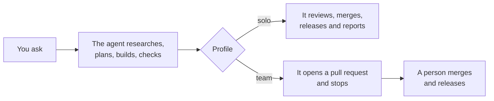

import { Aside, CardGrid, Card, LinkCard } from '@astrojs/starlight/components';

Once the first screens exist, the work settles into a rhythm: you ask, it
reports, you decide. This page is about the edges of that — how much the agent
finishes alone, where it stops, and what to do when it is stuck.

## The two profiles

One word in one file decides how far the agent goes on its own. You can change
it any day, and changing it is a sentence: "switch to team".

<CardGrid>
  <Card title="solo" icon="rocket">
    The agent reviews its own work, merges it and releases it, then tidies up after itself. No
    second pair of eyes. **This is right when the app is yours and the people using it are the ones
    who asked for it.**
  </Card>
  <Card title="team" icon="approve-check">
    The agent stops at a **pull request** — "please merge this" — and a person merges and releases.
    **Use it when more than one person is building, or when a mistake would reach people who did not
    ask for it.**
  </Card>
</CardGrid>

Either way the agent does the whole job up to its stopping point. It does not
hand you a half-finished change with a list of things to run.

## What it does without asking

These are the things it will get on with, because a rule or a script already
covers the risk:

- Reading anything in the project, and running the checks and the tests.
- Writing and changing screens, rules and database changes that a spec covers.
- Adding the index a new list needs, in the same change as the list.
- Updating the project's own written record: what changed, what was decided,
  what went wrong.
- In `solo`: reviewing, merging, releasing, and removing its own working copy.

## What it asks about first

Five things stop it and send it back to you. Each is something you would be
annoyed to discover afterwards:

| It asks before                                                            | Because                                                                 |
| ------------------------------------------------------------------------- | ----------------------------------------------------------------------- |
| deleting or rewriting data that is already live                           | there may be no way back, and only you know what the data is worth      |
| changing who can sign in, what a role may do, or how long a session lasts | a mistake here is a mistake about people, not about code                |
| adding a library that does what an existing one already does              | every extra piece is something to maintain and to explain forever       |
| any change to how the app is deployed                                     | the release path is the thing you rely on when something else is broken |
| spending your money — a new service, an account, a bigger server          | it is your card                                                         |

When it asks, it asks and stops. It does not ask and then carry on assuming yes.

## What it never does

Not "avoids" — a script refuses these, so a forgetful or over-eager session
cannot do them:

- Commit a password, a key or your server's address into the project.
- Edit a database change that has already been applied. Once a change has run,
  it is history; the next change is a new one.
- Write to the live database from outside the app. Not to fix one row, not at
  11pm. Data changes through the app or through a recorded change, so that it is
  reviewed and repeatable.
- Hide a failure — no empty error handling, nothing that swallows a problem to
  make the output look clean.
- Edit the shared interface components that come from a registry; those are
  re-fetched, never hand-modified.

<Aside type="tip" title="Turning off the constant asking">
  By default Claude Code asks before each command it runs, which gets tiring quickly. The fences
  above do not depend on your answering, so you can turn the asking down. How, and what the sandbox
  actually contains, is in [Setting up your own machine](../reference/agents.md).
</Aside>

## How to read the agent's report

Every finished piece of work is reported in three parts, and it is worth
reading them in this order:

1. **What changed for you.** In behaviour: "the list now shows who last touched
   each order, and sorts by that date". If you cannot picture the difference
   from this paragraph, ask for it again in plainer words — that is a fair
   request and the project's own rules require it.
2. **What was verified, and how.** Which check ran, and what it printed. "The
   tests pass" without the lines that say so is a claim, not a verification.
3. **What is not done, or not verified.** The most valuable part. A good report
   is explicit about the thing it could not test, the edge case left open, the
   step that needs you.

Two phrases worth noticing. **"Not verified"** means nobody has proved it —
try that part yourself. **"Handing back"** followed by a numbered list means
something lives in somebody else's website — your hosting provider, your domain
registrar, your e-mail provider — and the agent cannot reach it. Those lists
say exactly what to click and what to send back.

## When to start a new conversation

The agent holds everything said so far in view. When that fills up, it gets
slower, forgets earlier details, and starts making the kind of mistake it did
not make an hour ago.

Start a fresh conversation when:

- you move to an **unrelated** task — a different screen, a different question;
- the interview for a feature is finished and the building is about to start;
- it has gone in a circle twice;
- you come back the next day.

You lose nothing by doing it. Everything that matters — what the app is for,
what was decided, what went wrong before, the spec you approved — is written in
the project, and a new session reads it before it does anything.

## When to ask for a stronger model

A session cannot change its own model. When the agent says it needs a stronger
one, that is a request for you to switch, not a complaint — and it is cheaper
to agree than to spend another hour.

- **The everyday session** plans, reviews and decides.
- **A routine, well-fenced piece of work** can go to a faster and cheaper model;
  the agent chooses that for itself.
- **Reach for the strongest model** when a cause has not been found, when a
  decision spans the whole app, or when a bug has come back twice.

Before changing model, try raising the **effort** — the same model thinking
harder. It is the cheaper lever and it is often enough. Both levers, and what
each model costs, are in [Costs](./costs.mdx).

## Next

<LinkCard
  title="Publishing to your server"
  description="The afternoon where the app stops being yours alone: a server, a domain, e-mail, and the first release."
  href={`${import.meta.env.BASE_URL}guides/publishing/`}
/>
