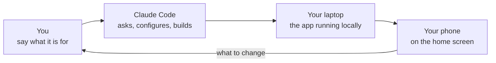

import { Aside, Tabs, TabItem, LinkCard } from '@astrojs/starlight/components';

By the end of this page the app is running on your laptop, it has your name in
it, and it is on your phone's home screen. Nothing here needs a server.

Set aside an unhurried hour. Most of it is the agent working while you read what
it says and answer questions.

## Before you start

- A **Claude subscription**. Pro at USD 20 is enough for this hour; see
  [Costs](./costs.mdx) before you commit to more.
- A **GitHub account**, free. Sign up at github.com if you do not have one.
- A Mac, or a Windows machine where you are willing to turn on WSL2 — see the
  Windows tab in step 1.

## 1. Install Claude Code

Claude Code is the desktop application you will talk to. It is the agent: it
reads the project, writes the files and runs the commands.

<Tabs syncKey="os">
  <TabItem label="Mac">
    Download the Claude Code desktop app from [claude.com/code](https://claude.com/code), open the
    downloaded file, drag it to Applications, and sign in with the account your subscription is on.

    > **You should see:** a window with a text box at the bottom, waiting for you to type.

  </TabItem>
  <TabItem label="Windows">
    Windows needs one extra thing first: **WSL2**, which is a real Linux running inside Windows.
    The fence that keeps the agent from touching anything outside your project only exists there.

    Open PowerShell as administrator, run `wsl --install`, restart when it asks, then install the
    Claude Code desktop app from [claude.com/code](https://claude.com/code) and sign in. When it
    asks where to work, choose a folder **inside** the Linux side rather than under `/mnt/c`, which
    is slow enough to be annoying all day.

    > **You should see:** a window with a text box at the bottom, and a path starting with `/home/`
    > rather than `C:\`.

  </TabItem>
</Tabs>

<Aside type="caution" title="If this went wrong">
  If sign-in does not recognise you, the usual cause is two accounts: the e-mail your subscription
  is on is not the one you signed in with. Check at claude.com which account holds the plan.

On Windows, if `wsl --install` reports that virtualisation is off, that is a setting in the
machine's firmware, not in Windows. Without WSL2 you can still work, but leave the agent's
automatic approval off — the reasoning is in
[Setting up your own machine](../reference/agents.md).

</Aside>

## 2. Copy the template on GitHub

Open [the InHouse repository](https://github.com/brocoders/inhouse-ai-starter-kit)
and press **Use this template → Create a new repository**. Give it the name of
the thing you are building — `orders`, `members`, `kit-register` — and choose
**Private**.

A **repository** is the folder holding your app's files and their whole history;
there is a five-word definition of every such word in the
[glossary](../reference/glossary.md).

> **You should see:** a repository under your own account, with the kit's files
> in it and one commit in its history.

<Aside type="caution" title="If this went wrong">
  No **Use this template** button means you are looking at somebody's fork rather than the template.
  Check that the address is exactly `github.com/brocoders/inhouse-ai-starter-kit`.
</Aside>

## 3. Open it in Claude Code

In Claude Code, choose to open a project from GitHub and pick the repository you
made. It clones it — copies it down to your machine — and reads its way in.

> **You should see:** the agent say what the project is, in a sentence or two,
> before you have asked it anything.

## 4. Type `/setup`

One word, into the text box, and press return. This is the only slash command you
need on the first day.

> **You should see:** the agent start asking questions instead of writing code.

## 5. Answer its questions

Five of them, one at a time. There is no wrong answer you cannot change later —
every one of them lands in a single small file you can edit any day.

| It asks                 | Answer with                                                                                                         |
| ----------------------- | ------------------------------------------------------------------------------------------------------------------- |
| What is the app called? | The name people will see in the browser tab and in e-mails. "Orders", not "orders-app-v2".                          |
| What is it for?         | One or two sentences: what it keeps track of, and for whom. This becomes the page every future session reads first. |
| Who else will use it?   | Only you, or a team. This sets the profile — see [Working day to day](./day-to-day.mdx).                            |
| Where are you?          | A city. It becomes the one time zone and the one date format the whole app uses.                                    |
| Do you have a server?   | "Not yet" is the right answer today.                                                                                |

> **You should see:** the agent read your answers back in plain words — "the app
> is called Orders, it shows times in Europe/Kyiv, and I will merge and release
> my own work" — and wait for you to agree.

## 6. Let it start the app

The agent installs what the app depends on, creates a database on your own
machine, puts some invented data in it, and starts the app. You do not type any
of those commands; it runs `pnpm install`, `pnpm db:seed --owner` and `pnpm dev`
and tells you what happened.

> **You should see:** a line naming the account it made for you, and a link with
> port 5173 in it.

<Aside type="caution" title="If this went wrong">
  "Port already in use" means an earlier attempt is still running. Say so to the agent — it closes
  the old one and starts again. There is nothing for you to fix by hand.
</Aside>

## 7. Open it on your laptop

Follow the link. Sign in with the address from the previous step.

> **You should see:** a working app with a few rows of made-up data in it — the
> worked example the kit ships with, which is there to be replaced.

## 8. Open it on your phone

This is the step people skip and it is the one that matters. These apps are used
standing up, in a warehouse or a corridor, and a screen that is fine on a laptop
is often unusable on a phone.

Ask the agent for the address to use from your phone. On the phone, on the same
Wi-Fi, open it. Then **iPhone: Share → Add to Home Screen**, or **Android: the
browser offers Install**.

> **You should see:** the app open from your home screen with its own icon and no
> browser bar around it.

<Aside type="caution" title="If this went wrong">
  Almost always the phone is on a different network — a guest Wi-Fi, or mobile data. Second most
  often, the laptop's firewall is on: on a Mac, System Settings → Network → Firewall.
</Aside>

## 9. Say what you actually need

The example records — "Items" — are a demonstration. Tell the agent what your
system is really about, and it offers to remove the example and start on the real
thing. That is the next guide.

> **You should see:** questions again, not code. Every new feature starts with an
> interview.

## What exists now

- A repository of your own with your app in it, and one small configuration file
  holding its name, its time zone and how much the agent finishes alone.
- A database on your laptop with invented data. Nothing has left your machine.
- A page describing what the app is for, which every future conversation reads
  before it does anything.

Nothing is public, nobody else can reach it, and no money beyond the subscription
has been spent.

## Next

<LinkCard
  title="Your first real screen"
  description="How a feature actually happens: describe, interview, spec, sketch, build, try it, release."
  href={`${import.meta.env.BASE_URL}guides/first-screen/`}
/>
