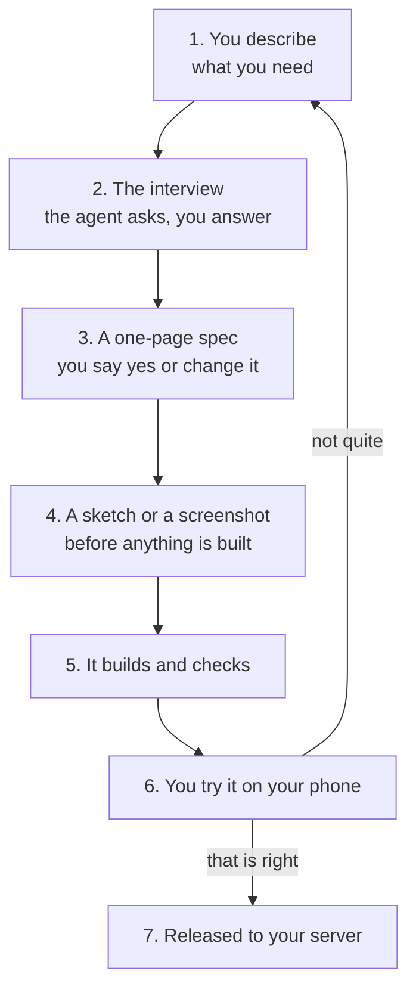

import { Aside, Steps, LinkCard } from '@astrojs/starlight/components';

Every feature, from the first one to the fiftieth, goes the same way. Learning
this loop once is most of learning to work with the agent.

A one-sentence change skips steps 2 to 4. "The date column should show the day
of the week" does not need an interview.

## The loop, step by step

<Steps>

1. **Describe what you need, in your own words.**

   Say it the way you would say it to a new colleague: who it is for, what they
   are trying to get done, and what is annoying about how it happens now. You do
   not need to know what screens there should be — working that out is the
   agent's half of this.

   > **You should see:** questions, not code.

2. **Answer the interview.**

   The agent asks about the people who will use it, the records involved, what
   "done" looks like on a phone, the awkward edges, and what is deliberately out
   of scope. It will not ask you anything it could have read for itself.

   Answer briefly. "I do not know yet" is a real answer and the agent will take
   the simpler road when it hears it.

   > **You should see:** the questions get more specific as you answer, and then
   > stop.

   <Aside type="caution" title="If this went wrong">
     If the questions feel like a form rather than a conversation — twenty at once, or things you
     already said — say so and ask it to start from what you have already told it. That is a sign
     the conversation has gone on too long; a fresh one often fixes it. See [when to start a new
     conversation](./day-to-day.mdx).
   </Aside>

3. **Read the one-page spec and say yes.**

   The agent writes a page: for whom, what a person can do, the screens, the
   records, the rules, what counts as done, and what is out of scope. It is in
   plain language on purpose — it is the thing you approve, and the thing a
   session six months from now reads to understand why the screen is like that.

   Read the **Done when** list especially. Those are the things you will try
   yourself at step 6, so if one of them is not what you meant, this is the
   cheapest moment in the whole loop to say so.

   > **You should see:** a page you could hand to a colleague, and a question
   > asking whether it is right.

4. **Look at the sketch.**

   For a new screen the agent shows you what it will look like before it builds
   it — a text outline, a wireframe, or a rendered screenshot of the empty
   screen, whichever fits. Changing a layout here costs a minute.

   > **You should see:** the arrangement of the screen, with the real words you
   > use for things.

5. **Let it build.**

   It works in small steps, each with a check that proves it. You will get a
   message between the research, the plan and the build rather than a long
   silence.

   > **You should see:** short progress messages, and at the end a report in
   > three parts: what changed for you, what was verified and how, and what is
   > not done.

   <Aside type="caution" title="If this went wrong">
     If a check fails twice with the same error, the agent is meant to stop and re-diagnose rather
     than try a third variation. If you see it circling, say "stop and tell me what you actually
     know" — and consider [asking for a stronger model](./day-to-day.mdx).
   </Aside>

6. **Try it on your phone.**

   Not on the laptop. Walk through the **Done when** list from the spec, as the
   kind of person who will really use it. Most of what needs changing is found
   in this step and nowhere else.

   Say what is wrong in the words you would use to a colleague: "the amount is
   too small to read", "this should default to today", "I need to see who
   entered it".

   > **You should see:** each item on the **Done when** list actually happen.

7. **Release it, when you want other people to have it.**

   One command, which the agent runs: `pnpm release <the commit id>`. It is
   gated at every step — see [Publishing to your server](./publishing.mdx) for
   what each gate means and what happens if one refuses.

   Until you have a server, there is nothing to release and the loop ends at
   step 6.

   > **You should see:** the agent tell you what shipped in terms of what is
   > different for you, not which files changed.

</Steps>

## What to say, and what not to say

The agent is good at deciding how. It cannot guess **why**, **for whom**, or
**what would be wrong**. Those three are your half of the conversation.

| Say this                                                     | Rather than               | Because                                                                            |
| ------------------------------------------------------------ | ------------------------- | ---------------------------------------------------------------------------------- |
| "Sales people need to see which quotes have gone quiet."     | "Add a status column."    | the first lets it design the screen; the second buys you a column you may not need |
| "If two people edit the same order, I need to know who won." | "Add optimistic locking." | naming the outcome keeps the choice of mechanism where the expertise is            |
| "This must be readable standing in a warehouse."             | "Make the font bigger."   | it tells the agent the constraint, so it holds for the next screen too             |
| "Do not touch the invoice numbering."                        | nothing                   | what is out of scope is information; silence is not                                |

Three things worth saying out loud early, because they are expensive to add
later: **who may see what**, **what must never be lost**, and **what has to
work on a phone**.

### Three example prompts that work

> Our sales team keeps quotes in a spreadsheet. I need to see, on my phone, every
> quote that has had no movement for two weeks, with the client's name and the
> amount, newest first. Only I and the two sales people should see amounts.

Why it works: the people, the moment, the device, the ordering, and one rule
about who sees what.

> When somebody marks an expense as approved, the person who submitted it should
> get an e-mail that evening — not immediately, because approvals come in
> batches and I do not want to send five. Nothing else changes.

Why it works: the trigger, the timing, the reason for the timing, and an
explicit boundary at the end.

> The equipment list is right but unusable on a phone: I cannot tell at a glance
> what is out on loan. I do not know what it should look like — that is your
> half. It has to work with about four hundred items.

Why it works: it names the problem rather than the solution, and it gives the
size, which is the fact that decides how the list is built.

### What not to say

- **File names and technical instructions.** "Put it in `orders.tsx`" replaces
  the agent's judgment with a guess. Say what you want to happen.
- **Several unrelated things at once.** Each feature gets its own conversation
  and its own spec. Two at once means both are half-described.
- **"Make it better."** There is nothing to check against. Say what is wrong
  with it now.
- **"Whatever you think."** For a design detail this is fine. For who may see a
  number, it is not — the agent will ask, and it should.

<Aside type="tip" title="One feature, one conversation">
  Start a new conversation for each new feature. The agent carries everything said so far, and an
  hour of interview noise makes the build that follows slower and worse. The spec is what crosses
  between them, which is the whole reason it is written down.
</Aside>

## Next

<LinkCard
  title="Working day to day"
  description="What the agent does without asking, what it asks about first, and what it will never do."
  href={`${import.meta.env.BASE_URL}guides/day-to-day/`}
/>
