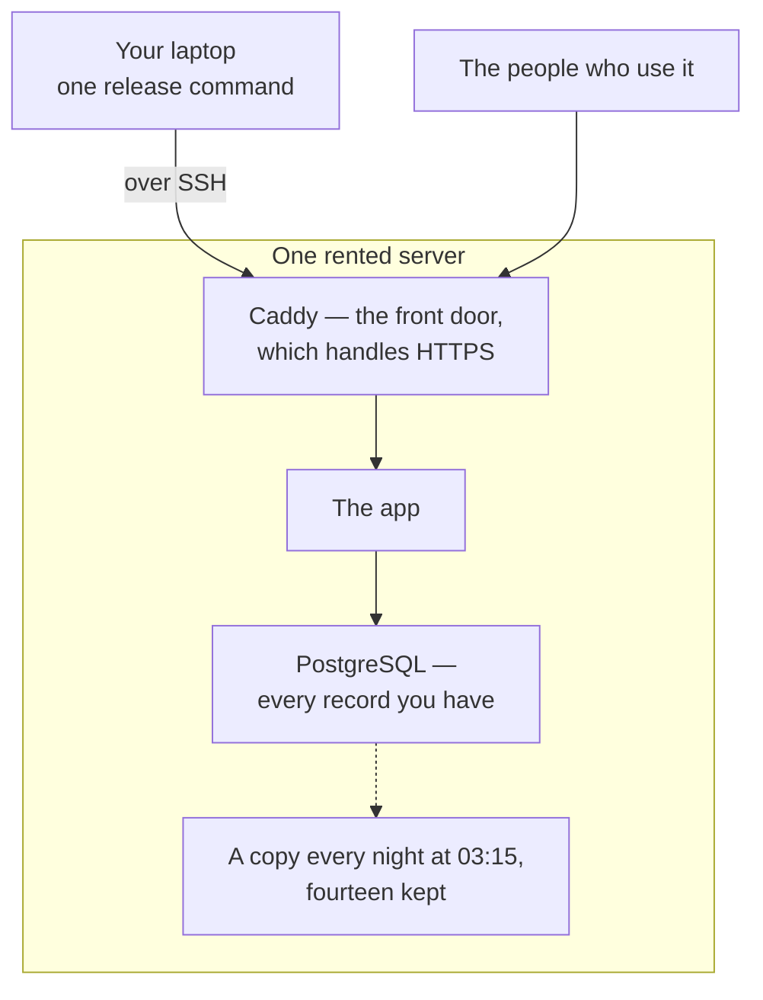

import { Aside, Tabs, TabItem, LinkCard } from '@astrojs/starlight/components';

An afternoon's work, once per app. After it, putting a change in front of people
is one command.

Three of the six steps below happen inside somebody else's website and cannot be
automated: renting the machine, pointing the domain, and getting an e-mail key.
The agent will hand those to you as a numbered list and wait. The rest is a
single command each, which the agent runs.

## What you are about to buy

| Thing            | Roughly                | Notes                                                             |
| ---------------- | ---------------------- | ----------------------------------------------------------------- |
| One server       | EUR 5–15 a month       | 2 cores and 4 GB is a sensible floor                              |
| Provider backups | +20–30 % of the server | one checkbox, and the most important few euros in this whole page |
| A domain         | EUR 10–15 a year       | or a subdomain of one you already own, which costs nothing        |
| E-mail sending   | free                   | 3,000 e-mails a month is far more than these apps send            |

## 1. Rent the server, and turn its backup option on in the same visit

Any of these three providers is fine. Choose on price and on **which country you
want the data in**, because that is the part that is hard to change later. Choose
**Ubuntu 24.04**, and add your SSH key when it asks — an **SSH key** is a
password you never type, a file on your laptop that proves who you are.

<Tabs syncKey="provider">
  <TabItem label="Hetzner">
    1. Console → **Add Server**.
    2. Location: pick the country the data should live in.
    3. Image: **Ubuntu 24.04**.
    4. Type: **CX22** (2 cores, 4 GB, about EUR 4 a month).
    5. **Tick "Backups" in the same form** — it costs 20% of the server price and keeps 7 daily
       copies of the whole machine.
    6. SSH keys: add yours.
    7. Create, and write down the IP address it shows you.

    If you missed the checkbox: Server → **Backups** tab → Enable.

  </TabItem>
  <TabItem label="DigitalOcean">
    1. **Create → Droplets**.
    2. Region: pick the country the data should live in.
    3. Image: **Ubuntu 24.04 (LTS)**.
    4. Size: **Basic, 2 GB** (about USD 12 a month).
    5. Under **Additional options**, tick **Enable automated backups** — weekly costs 20% of the
       droplet, daily 30%. Take daily.
    6. Authentication: **SSH Key**, add yours.
    7. Create, and write down the IP address.

    If you missed it: Droplet → **Backups** → Setup Automated Backups.

  </TabItem>
  <TabItem label="Hostinger">
    1. hPanel → **VPS** → buy a plan; **KVM 2** (about EUR 7 a month) is enough.
    2. Choose the data-centre location deliberately.
    3. Operating system: **Ubuntu 24.04**.
    4. Add your SSH key in **SSH Keys**.
    5. Open **Backups & Monitoring**. Weekly backups are included; daily is a paid add-on and is
       worth it.
    6. Write down the IP address.

  </TabItem>
</Tabs>

> **You should see:** an IP address — four numbers like `203.0.113.10` — and a
> backup option that says it is on.

<Aside type="danger" title="Do not leave the backup checkbox for later">
  It is the only thing here that protects you from losing the machine itself. It costs a few euros a
  month, it takes one click while you are already in the form, and nobody has ever turned it on
  after they needed it. The nightly copy of the database sits on the same disk as the database, so
  it answers "the wrong record was deleted" and does not answer "the server is gone".
</Aside>

## 2. Point your domain at it

Wherever you bought the domain, find **DNS** settings and add one record:

| Type | Name                                                      | Value              |
| ---- | --------------------------------------------------------- | ------------------ |
| A    | the part before your domain, or `@` for the domain itself | the IP from step 1 |

> **You should see:** after a few minutes, your app's address answering with that
> IP. The agent can check this for you in one command.

<Aside type="caution" title="If this went wrong">
  DNS changes normally take minutes and occasionally an hour. Go and do step 3 while you wait;
  nothing until step 5 needs the domain. If it is still wrong after an hour, the usual cause is a
  second A record left over from the domain's parking page — remove it.
</Aside>

## 3. Set the machine up _(the agent runs this)_

One command turns a bare Ubuntu machine into one that can run your app. It
creates a user, turns off password logins entirely, closes every port except SSH
and the web, installs **Docker** — which runs the app in a sealed box — makes the
folders, writes a settings file, and schedules a copy of the database every night
at 03:15.

> **You should see:** about fifteen numbered lines, each saying what it did, and a
> summary at the end saying what is left.

It is safe to run again: every step checks first and says "already done" rather
than doing it twice. If it stops halfway, the agent fixes what it complained
about and runs the same line again.

<Aside type="caution" title="If this went wrong">
  "Permission denied" at the very start means the provider did not put your SSH key on the machine.
  Most providers let you paste the key into the server's settings page and rebuild it; that is
  quicker than any other fix.
</Aside>

## 4. Get an e-mail key and fill in two lines

Your app sends sign-in links and invitations. That needs an account with an
e-mail provider — the kit uses **Resend**, which is one key and no settings to
get wrong.

1. Sign up at [resend.com](https://resend.com). The free tier is 3,000 e-mails a
   month, 100 a day.
2. **Domains → Add domain** → type your domain. It shows three DNS records; add
   them where you added the A record in step 2.
3. **API Keys → Create API Key.** Copy it — it starts with `re_` and is shown
   once. Put it in your password manager now.
4. Give it to the agent to put on the server, along with the name and address you
   want e-mail to come from.

> **You should see:** the domain in Resend turn from "pending" to "verified",
> usually within minutes of adding the records.

<Aside type="tip" title="If you skip this">
  Nothing breaks. The app runs and writes the e-mails it would have sent into its own log instead.
  Sign-in links will not arrive, so you sign in with the password account made during setup, and
  invitations wait until you come back to this step.
</Aside>

## 5. Release _(the agent runs this)_

`pnpm release <the commit id>` — the long name of the exact saved change being put
live. The first one takes longer than the rest: it builds everything from scratch
and waits for the front door to fetch an HTTPS certificate.

> **You should see:** at the end, `Released … to your-domain` and an invitation to
> go and look at it.

## 6. Open it on your phone, from the home screen

Sign in as yourself, add it to the home screen again — this time on the real
address — and invite one other person. That last part is the actual test: an
invitation that never arrives is an e-mail problem, and this is when you find
out.

> **You should see:** the app on HTTPS, with no browser bar, and your colleague
> able to sign in from the link they received.

## What a release prints, and what each line means

A release is a series of gates. **Until the switch, a failure leaves the previous
version running and the database exactly as it was.** The script stops, says
which gate refused and why, and tidies up after itself either way.

| It prints                                 | What happened                                                                                                                                                  |
| ----------------------------------------- | -------------------------------------------------------------------------------------------------------------------------------------------------------------- |
| `checking that … is on the main branch`   | Only finished, merged work gets released. Something still on a side branch is refused.                                                                         |
| `asking … what is running now`            | It reads which version the server is currently serving.                                                                                                        |
| `replacing …, which … contains`           | What is running has to be contained in what is going out. This is what stops a release from quietly undoing a newer one.                                       |
| `packed … digest matches on the server`   | The exact change was packed, sent, and its fingerprint checked on the far side, so a transfer that lost bytes stops here.                                      |
| `building the image on the server`        | The app is compiled **on the server**. Nothing from the laptop goes into what runs.                                                                            |
| `backup verified`                         | A copy of the database, taken before anything changes, and checked for being a real file rather than an empty one.                                             |
| `the migration runs cleanly on real data` | That backup is restored into a scratch database and the database change is rehearsed against it. A change proved only against an empty database is not proved. |
| `schema is up to date`                    | The same change, now on the real database.                                                                                                                     |
| `the new container is running`            | **The switch.** The old app stops, the new one starts, and requests arriving in those seconds wait rather than fail.                                           |
| `the app answers /health/ready`           | The site is up.                                                                                                                                                |
| `serving <commit>`                        | And it is the version that was sent, not the old one still answering.                                                                                          |
| `releases_removed=… disk=…`               | Old releases and dumps over a fortnight old cleared out, and how much disk is left.                                                                            |
| `Released … in Xm Ys`                     | Done.                                                                                                                                                          |

**A release takes up to an hour.** A long silent stretch during the test phase
and a pause of a few minutes at the switch are both normal.

### When a release refuses

The refusals are the system working, not failing.

- **"is not on main"** — the change has not been merged yet. Merge first.
- **"does not contain the running release"** — something newer is already live,
  and releasing this would undo it. The agent merges and releases again.
- **"the migration failed against a copy of the real data"** — the good outcome.
  The database change works on an empty database but not on yours. **Nothing
  changed and the live app is still serving.**
- **"did not answer within two minutes"** — the only one that matters to you.
  This is after the switch, so the site is down. The agent reads the log and goes
  back to the previous version, which takes a minute or two.

<Aside type="caution" title="Going back is not undoing">
  Returning to an older version returns the code, not the database. If the newer version changed the
  shape of the database, older code may not work with it. Going back is for "the new screen is
  broken", not for "the new database change was wrong" — that one is fixed forwards.
</Aside>

## What you now have, and what protects it

- Your app on your domain, on HTTPS, installable on a phone.
- A copy of the database every night, kept fourteen days, plus one taken
  immediately before every release.
- A copy of the whole machine on your provider's schedule.

Two more things are worth an evening in the first week: **prove a restore
works**, and read what the two copies do and do not protect against. Both are in
[Backups](../reference/backups.md). A copy nobody has restored from is a hope,
not a backup.

<Aside type="caution" title="Not yet rehearsed end to end">
  Rebuilding onto a brand-new machine from a database dump alone — new server, set it up, release,
  restore, re-enter the e-mail key — has each of its pieces working, but nobody has yet done all of
  them in order on a bare machine. If you ever have to, expect one detail to need fixing, and tell
  the agent to correct the written procedure when you find it. The procedure is in [Running
  it](../reference/running.md).
</Aside>

## Next

<LinkCard
  title="What is built in"
  description="Everything your app already has on the first day, and what it means for you."
  href={`${import.meta.env.BASE_URL}guides/built-in/`}
/>
