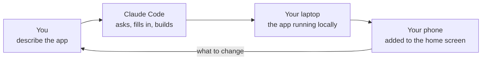

import { Aside, Card, CardGrid, LinkCard } from '@astrojs/starlight/components';

InHouse is a starter kit for founders, leaders and managers who want a system
of their own for how their company, team or community works — instead of
spreadsheets, an expensive or ill-fitting SaaS, or a tool that almost does the
job. You describe what you need; an AI coding agent builds it on foundations
that are already decided, tested and written down.

You will not read code. You will read what the agent reports, look at screens,
say what is wrong, and decide when something is ready for other people.

## Who it is for

<CardGrid>
  <Card title="The founder running the company from spreadsheets">
    Orders, cash, clients and commitments live in Google Sheets, a chat and their head. They want
    one place that is always current, that the team updates from their phones, and that tells them
    when something needs attention.
  </Card>
  <Card title="The operations or finance leader replacing a tool that stops short">
    An outdated desktop program, an expensive SaaS used at ten percent, or a good product that does
    not do the one thing their process needs. They want a few roles — who enters, who approves, who
    only sees — a record of every change, and a monthly figure they can trust.
  </Card>
  <Card title="The leader of a team or community with its own way of working">
    Members, schedules, dues, attendance, decisions — a process no product matches, run by people
    who know each other by name.
  </Card>
</CardGrid>

It works for personal systems too — a household, a side project — and the first
app built on these foundations was exactly that.

## What you build

A private web application that is the system of record for one part of your
business or life: it stores the records, shows the current state, and answers
questions about it. Not a public product. No sign-up page, no strangers — the
people who use it are people you invite by name.

Kinds of apps it fits best: a small CRM or pipeline; a ledger, cash-flow or
budget tracker; expense or leave approvals; inventory, equipment or asset
registers; membership and dues; attendance and shifts; a task tracker shaped to
your team; a KPI dashboard fed from other systems. There is a
[one-page brief for six of those](../recipes/index.mdx) that the agent can start from
today.

Everything that usually takes the first month — sign-in, roles, history, lists
that stay fast, scheduled jobs, notifications, backups, releases — is already
there and already tested. [What is built in](./built-in.mdx) is the full list.

## The one-hour promise

**Your first real screen exists within an hour of copying the template.** That
is the deadline the whole kit is built around, and it is why so much is decided
in advance.

What that hour contains, and who does which part:

The server, the domain and the e-mail key are **not** in that hour. They come
later, on the day you want other people in — see
[Publishing to your server](./publishing.mdx).

## What only you can provide

Five things. The agent cannot get any of them for you, because each one is an
account in somebody's name and that name has to be yours.

| What                       | When                  | Why it has to be you                                                                                              |
| -------------------------- | --------------------- | ----------------------------------------------------------------------------------------------------------------- |
| A **Claude subscription**  | before anything       | the agent that builds your app runs on it, and it is billed to a person, not to a project                         |
| A **GitHub account**       | first ten minutes     | your app's files and their whole history live there, under your login, so the work is yours and not on one laptop |
| A **server**               | the day others use it | it is rented in your name, in a country you choose, and that choice decides where your company's data sits        |
| A **domain**               | same day              | the address people type belongs to you, so nothing you publish depends on somebody else's name                    |
| An **e-mail provider key** | same day              | sign-in links and invitations are sent as you, from your domain, which needs an account somebody owns             |

<Aside type="tip" title="Which Claude plan">
  **Max 20x (USD 200 a month)** is the recommendation for building an app over several weeks. Pro at
  USD 20 is enough to try the kit and make small changes. The reasoning, and what the server and the
  rest cost, are in [Costs](./costs.mdx).
</Aside>

A **[repository](../reference/glossary.md)** — the folder holding your app's
files and history — is what GitHub gives you. You will hear the word constantly
and never need to do anything with it by hand.

## What it will cost, roughly

Around **USD 200–250 a month while you are building**, almost all of it the AI
subscription, and **EUR 10–20 a month to run** once the app is live and you
change it rarely. [Costs](./costs.mdx) has the breakdown and the date it was last
checked.

## What this kit is not

- Not a product you configure. It is a starting point an agent builds on.
- Not for thousands of strangers. One organisation, people you know by name.
- Not a replacement for judgment. The agent asks before anything irreversible,
  and there are things it will never do at all — those are listed in
  [Working day to day](./day-to-day.mdx).

## Next

<LinkCard
  title="Your first hour"
  description="Install Claude Code, copy the template, answer its questions, and open your own app on your phone."
  href={`${import.meta.env.BASE_URL}guides/first-hour/`}
/>
