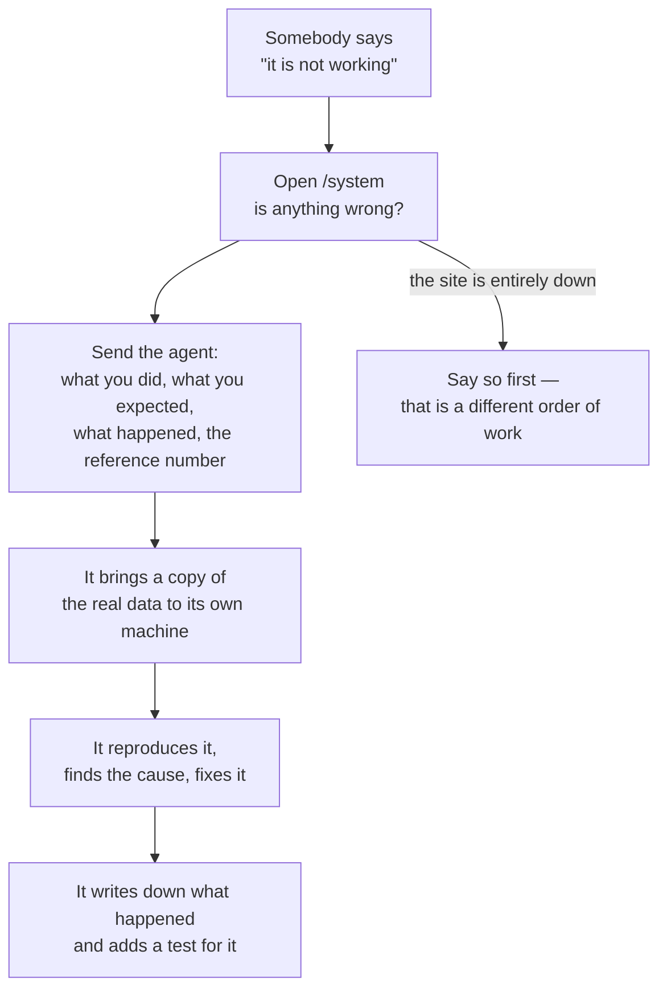

import { Aside, Steps, LinkCard } from '@astrojs/starlight/components';

Something will break. The useful question is not how to prevent that but how
little damage it does and how quickly you find out. This page is the order to do
things in.

## First: the system screen

Sign in and open **`/system`**. Only the owner can see it.

It is built to show **only what is wrong**. When nothing is, it says so in one
line instead of making you read a page of green ticks. When something is, that
is the first thing on the page.

What it can tell you:

| Section                         | What to make of it                                                                          |
| ------------------------------- | ------------------------------------------------------------------------------------------- |
| **Needs attention**             | The short list of things actually wrong now. Read it first and send it to the agent.        |
| **Scheduled work**              | Whether the jobs that run on a clock are running, queued, or failing.                       |
| **Errors in the last 24 hours** | Grouped, with how many times each happened. "It has been odd since yesterday" starts here.  |
| **Last backup**                 | When the database was last copied. If this is not from last night, treat it as the problem. |
| **Disk**                        | How much room is left. A full disk breaks things in ways that look like other problems.     |
| **Release**                     | Which version is running, and since when. Useful when "it started after the update".        |

<Aside type="tip" title="Being told rather than looking">
  Nothing e-mails you about this by default. A message when a job fails, or a short daily summary of
  the last day's errors, is a sensible early thing to ask for — it is a scheduled job plus the
  notification the kit already has, and it is the difference between finding out on Tuesday and
  finding out in March.
</Aside>

## What to send the agent

Four things, and the fourth is the one people leave out:

<Steps>

1. **What you were doing.** "Approving an expense from the list, on my phone."

2. **What you expected.** "It should go green and drop off the list."

3. **What happened instead.** In your own words. A screenshot is better than a
   description, and a screenshot of the phone is better than one of a laptop if
   that is where it happened.

4. **The reference number.** When a screen fails it shows a line reading
   **Reference** followed by a short code. That code is the single most useful
   thing you can send: it lets the agent find the exact moment in the record of
   what the app was doing, rather than guessing from the time.

   > **You should see:** a "Reference …" line under the error message. If there
   > is none, say that too — its absence is itself information.

</Steps>

Also say **whether anything changed that should not have** — a record that
looks wrong, a number that moved, an e-mail that went to the wrong person. That
changes the order the agent works in, because data is the part that cannot be
rebuilt from the project.

## How the agent investigates

You do not have to ask for this; it is how it works. It is worth knowing so that
the reports make sense.

<Steps>

1. **It brings a copy of the real data down to its own machine** — one command,
   `pnpm db:copy`, optionally with the names scrambled if a screenshot is going
   to be shown to anyone. Everything after this happens on the copy.

   Why it matters to you: **investigating never touches what people are using.**
   No experiment on the live system, no "let me try one thing".

2. **It reproduces the problem.** A bug that cannot be reproduced is a guess
   about to be shipped. If it cannot reproduce it, that is information too — the
   difference between its copy and your live app is where the bug lives.

3. **It reads what was recorded**, following your reference number through every
   line it appears in.

4. **It probes from more than one angle** before naming a cause. One negative
   result is not a diagnosis, and an outside service is rarely the culprit.

5. **It fixes the cause, not the symptom.** A command handed to you to clean up
   the mess is not a fix.

6. **It writes down what happened** — what you saw, why, and what now stops it
   happening again — and adds a check that would have caught it. If it reached
   other people, that write-up is a proper incident record.

</Steps>

<Aside type="danger" title="One rule that is never bent">
  Nothing writes to the live database from outside the app. Not to correct one row, not at 11pm, not
  "only this once". Data changes through the app or through a recorded, reviewable database change —
  otherwise the app's history stops being true, and the history is the thing you bought.
</Aside>

## Three situations, three different answers

**"A screen is wrong."** Send the four things above. Nothing is on fire; the
loop in [Your first real screen](./first-screen.mdx) handles it.

**"The whole site is down."** Say that first and say it plainly. This is the one
case where the order changes: get the previous version back, then find out why.
Going back to the last version takes a minute or two and does not need the cause
to be known.

**"A number is wrong / a record is missing."** This is the serious one. Say what
you noticed and **stop using the affected part of the app** until the agent has
looked. Every extra change made on top of wrong data is another thing to unpick.
The nightly copy and the copy taken before every release are what make this
recoverable — see [Backups](../reference/backups.md).

## When to call a person

The agent is good, and there are four moments where a human being is the right
answer:

- **The hosting provider**, when the machine itself is unreachable or the
  provider's own status page says something. No amount of cleverness fixes a
  data centre.
- **Your domain registrar**, when the address stops resolving and the DNS record
  looks right.
- **The e-mail provider**, when mail is being accepted and not delivered.
- **Somebody who does this for a living**, when the app has become genuinely
  business-critical — when a day without it costs real money or real trust.
  That is also the moment to add a third copy of your data; see
  [Backups](../reference/backups.md).

<Aside type="tip" title="Ask for the write-up">
  After anything that reached other people, ask for the incident record and read it. It is one page:
  what happened, what you saw, why, and what now prevents it. Reading them is how you learn where
  your own system is thin.
</Aside>

## Next

<LinkCard
  title="Costs"
  description="What building and running this actually costs, month by month."
  href={`${import.meta.env.BASE_URL}guides/costs/`}
/>
